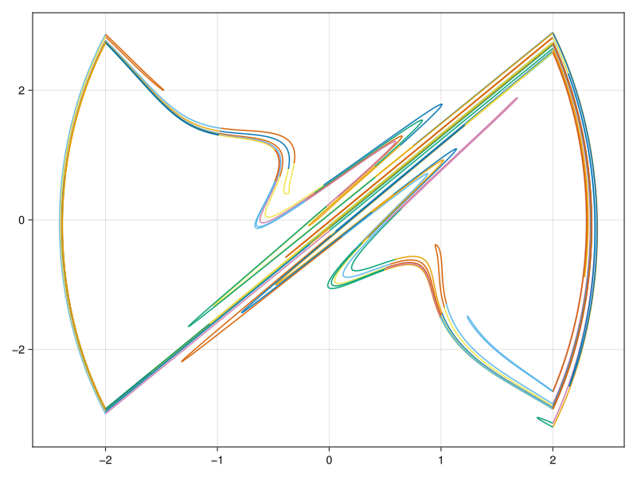
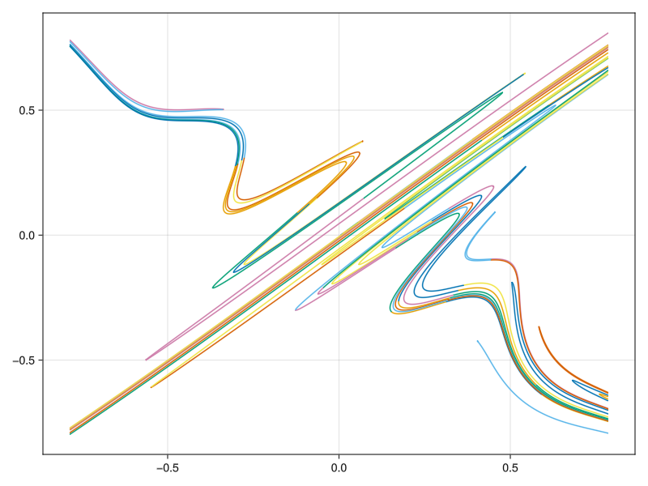

# Examples

## Unstable manifold of Henon map
Consider the Henon map:

```math
\begin{aligned}
x'&=1-\alpha x^2+y,\\
y'&=\beta x,
\end{aligned}
```

where $\alpha=1.4,\beta=0.3$. This map has a saddle located at $(0.6313544770895048, 0.18940634312685142)$, and its unstable eigenvector is $(-0.9880577559947047, 0.15408397327012555)$. 

To compute the unstable manifolds of the saddle numerically, InvariantManifolds.jl just needs a segment of unstable manifold, whose start point is the saddle.
It's resonable to choose a short unstable eigenvector as the segment. You don't have to shorten the eigenvector started at the saddle yourself. We provide a function `segment` to do this automatically. The `segment` can generate equal distributed `n` points at one point, with given length and direction.
```julia
using InvariantManifolds, StaticArrays

function henonmap(x, p)
    y1 = 1 - p[1] * x[1]^2 + x[2]
    y2 = p[2] * x[1]
    SA[y1, y2]
end

henonmap2(x, p)=henonmap(henonmap(x, p), p)

# For technical reason, we have to use the double iteration of the map, since the eigenvalue is less than -1.

seg = segment(SA[0.6313544770895048, 0.18940634312685142], SA[-0.9880577559947047, 0.15408397327012555], 150, 0.01)
result = generate_curves(henonmap2, SA[1.4, 0.3], seg, 0.001, 8)
```

This package does not provide any function to plot the manifolds. However, it's simple to plot it using the stardard julia ploting library.

To do this, just run
```julia
using GLMakie
function manifold_plot(v::Vector{IterationCurve})
    figure = Figure()
    axes = Axis(figure[1,1])
    for k in eachindex(v)
        data = v[k].pcurve.u
        lines!(axes, first.(data), last.(data))
    end
    figure
end
manifold_plot(result)
```

```@raw html

```

## Unstable manifold of the periodic perturbed system:
Consider the Duffing equation with periodic perturbation:

```math
\begin{aligned}
\dot{x}&=y,\\
\dot{y}&=x-x^3+\gamma \cos(t).
\end{aligned}
```

When $\gamma=0$, the system has a saddle located at $(0,0)$. After the small periodic perturbation,
this saddle becomes a saddle periodic orbit, i.e., a saddle of the map $T:x\mapsto \phi(X,2\pi,0)$, where
$\phi(X,t,t_0)$ is the solution of system with initial condition $X(t_0)=X\in\mathbb{R}^2$. Fortunately, we can use
the solution of the variational equation to get the jacobian matrix of $T$. The map $T$'s saddle's location and unstable direction can also be obtained numerically.

```julia
using InvariantManifolds, LinearAlgebra, StaticArrays, OrdinaryDiffEq, GLMakie
# Duffing Equation

f(x, p, t) = SA[x[2], x[1] - x[1]^3 + p[1]*cos(t)]

# First find the fixed point and its unstable direction by using the Newton iteration.

function timemap(x,p)
    prob = ODEProblem{false}(f, x, (0.0, 2pi), p)
    solve(prob, Vern9())[end]
end

# Solving the variational equation to get the jacobian matrix.

function jac(x, p)
    prob = ODEProblem{false}(f, x, (0.0, 2pi), p)
    sol = solve(prob, Vern9())
    function df(x, p, t)
        SA[0 1; 1-3*(sol(t)[1])^2 0] * x
    end
    ii = SA[1.0 0.0; 0.0 1.0]
    nprob = ODEProblem{false}(df, ii, (0.0, 2pi), p)
    solve(nprob, Vern9())[end]
end

# Newton's iteration to get the saddle's location.

function newton(x, p; n=100, atol=1e-8)
    xn = x - inv(jac(x, p) - I) * (timemap(x, p) - x)
    data = typeof(x)[x, xn]
    i = 1
    while norm(data[2] - data[1]) > atol && i <= n
        data[1] = data[2]
        data[2] = data[1] - inv(jac(data[1], p) - I) * (timemap(data[1], p) - data[1])
        i = i + 1
    end
    if norm(data[2] - data[1]) < atol
        println("Fixed point found successfully:")
        data[2]
    else
        println("Failed to find a fixed point after $n times iterations. The last point is:")
        data[2]
    end
end

function manifold_plot(v)
    figure = Figure()
    axes = Axis(figure[1,1])
    for k in eachindex(v)
        data = v[k].pcurve.u
        lines!(axes, first.(data), last.(data))
    end
    figure
end

para = [0.1]
fixedpoint = newton(SA[-0.05, 0.0], para)
unstable_direction = eigen(jac(fixedpoint, para)).vectors[:, 2]
seg = segment(fixedpoint, unstable_direction, 150, 0.01)
result = generate_curves(timemap, para, seg, 0.002, 3)
manifold_plot(result)
```

```@raw html

```

## Lorenz manifold

In this example, we will consider the well known Lorenz's equation. With classical parameters, the fixed point origin has two linear independent stable direction. Hence, there exists a two-dimensional stable manifolds of the
origin, the so called Lorenz manifold. The function [`generate_surface`](@ref) mainly needs two parameter to compute such stable manifolds. The first parameter is the time-$T$-map of the system, where $T<0$. Moreover, the original vector field has to be rescaled to ensure the uniform extension of the flow. The second parameter is the two linear independent stable direction. See the blew codes for more details.

```julia
using InvariantManifolds, LinearAlgebra, StaticArrays, OrdinaryDiffEq, GLMakie

# First define the rescaled lorenz vector field and its time-T-map

function lorenz(x, p, t)
    σ, ρ, β = p
    v = SA[σ*(x[2]-x[1]),
        ρ*x[1]-x[2]-x[1]*x[3],
        x[1]*x[2]-β*x[3]
    ]
    v / sqrt(1 + norm(v)^2)
end

function lorenz_map(x, p)
    prob = ODEProblem{false}(lorenz, x, (0.0, -2.0), p)
    sol = solve(prob, Tsit5())
    sol[end]
end

function eigenv(p)
    σ, ρ, β = p
    (SA[0.0, 0.0, 1.0], SA[-(-1 + σ + sqrt(1 - 2 * σ + 4 * ρ * σ + σ^2))/(2*ρ), 1, 0])
end

second(x) = x[2]

function manifold_plot(annulus)
    fig = Figure()
    axes = LScene(fig[1, 1], show_axis=false,scenekw = (backgroundcolor=:white, clear=true))
    for i in eachindex(annulus)
        points = annulus[i].outer.pcurve.u
        scatter!(axes, first.(points), second.(points), last.(points), fxaa=true)
    end
    fig
end
para = [10, 28, 9 / 3]
lorenz_manifold = generate_surface(lorenz_map, para, SA[0.0, 0.0, 0.0], eigenv(para)..., 120, 1, 1)
manifold_plot(lorenz_manifold)
```

```@raw html

```

## Unstable manifold of the piecewise smooth ODE's time-$T$-map

Consider a simple piecewise smooth system:

```math
\begin{aligned}
\dot{x}&=y,\\
\dot{y}&=f(x) + \epsilon \sin(2\pi t),
\end{aligned}
```

where

```math
f(x) =
\begin{cases}
-k_1 & \text{if } x < -d,\\
k_2 & \text{if } -d<x<d,\\
-k_3 & \text{if } x > d.
\end{cases}
```

where $k_1,k_2,k_3,d>0$ are positive parameters. We are going to compute the time-1-map' unstable manifolds of saddle located near $(0,0)$ when $\epsilon$ is small.

First, we define a piecewise smooth vector field:

```julia
using InvariantManifolds, LinearAlgebra, StaticArrays, OrdinaryDiffEq, GLMakie

f1(x, p, t) = SA[x[2], p[1]*x[1]+p[4]*sin(2pi * t)]

f2(x, p, t) = SA[x[2], -p[2]*x[1]+p[4]*sin(2pi * t)]

f3(x, p, t) = SA[x[2], -p[3]*x[1]+p[4]*sin(2pi * t)]

hyper1(x, p, t) = x[1] - p[5]

hyper2(x, p, t) = x[1] + p[5]

dom1(x, p, t) = -p[5] < x[1] < p[5]

dom2(x, p, t) = x[1] > p[5]

dom3(x, p, t) = x[1] < -p[5]

vectorfield = PiecewiseV([f1, f2, f3], [dom1, dom2, dom3], [hyper1, hyper2])
```
The parameters pass to `PiecewiseV` are vector fields, their definition domains, and the hyper surfaces separating these domains. See [`PiecewiseV`](@ref) for more details.

Then we set the information needs when computing the time-1-map:

```julia
setup = setmap(vectorfield, (0.0, 1.0), Tsit5(), 2, Float64)
```

See [`setmap`](@ref) for the meaning of parameters of this function. For small $\epsilon$, the amplitude of the saddle periodic orbit is small so that the orbit is in domain `dom1`.
So we can still using the method of variational equation to compute the saddle's location.

```julia
function jac(x,p)
    prob = ODEProblem{false}(f1, x, (0.0, 1.0), p)
    sol = solve(prob, Vern9())
    function df(x, p, t)
        SA[0 1; p[1] 0] * x
    end
    ii = SA[1.0 0.0; 0.0 1.0]
    nprob = ODEProblem{false}(df, ii, (0.0, 1.0), p)
    solve(nprob, Vern9())[end]
end

function newton(x,p; n=100, atol=1e-8)
    xn = x - inv(jac(x,p) - I) * (timemap(x,p) - x)
    data = [x, xn]
    i = 1
    while norm(data[2] - data[1]) > atol && i <= n
        data[1] = data[2]
        data[2] = data[1] - inv(jac(data[1],p) - I) * (timemap(data[1],p) - data[1])
    end
    if norm(data[2] - data[1]) < atol
        println("Fixed point found successfully:")
        data[2]
    else
        println("Failed to find a fixed point after $n times iterations. The last point is:")
        data[2]
    end
end
```

Then we define the parameters and try to find the saddle:

```julia
para = [2, 5, 5, 0.6, 2, 1]
fixedpoint= newton(SA[0.0, 0.0],para)
unstable_direction = eigen(jac(fixedpoint,para)).vectors[:,2]
```

!!! warning "Warning"
    In a system of `PiecewiseV`, the parameter should be a vector and always has extra elements in the end. In this example, we only use five
    parameters $k_1,k_2,k_3,\epsilon,d$. However, you should set it to a six element vector. The last parameter is
    to switch the vector field, and its value can be arbitrary.

As before, we compute the manifold and plot it using `GLMakie`. Noting that the data structures of `result` is slightly different from examples before.

```julia
seg = segment(fixedpoint, unstable_direction, 150, 0.05)
result = generate_curves(setup, para, seg, 0.01, 9)

function manifold_plot(result)
    fig = Figure()
    axes = Axis(fig[1,1])
    for k in eachindex(result)
        for j in eachindex(result[k])
            data=result[k][j].pcurve.u
            lines!(axes,first.(data),last.(data))
        end
    end
    fig
end

manifold_plot(result)
```

```@raw html

```

## Unstable manifold of the impact inverted pendulum's time-$T$-map

Consider an inverted pendulum with two side walls and a small periodic perturbation:

```math
\begin{aligned}
\dot{x}&= y,\\
\dot{y}&= sin(x) - \epsilon \cos(2\pi t),
\end{aligned}
```

When $x=\xi$ or $x=-\xi$, we have $y\rightarrow - ry$.

The procedure for computing such system's manifold is similar with before, we just give codes here:

```julia
using InvariantManifolds, LinearAlgebra, StaticArrays, OrdinaryDiffEq, GLMakie

f(x, p, t) = SA[x[2], sin(x[1])-p[1]*cos(2 * pi * t)]

hyper1(x, p, t) = x[1] + p[2]

hyper2(x, p, t) = x[1] - p[2]

rule1(x, p, t) = SA[x[1], -p[3]*x[2]]

rule2(x, p, t) = SA[x[1], -p[3]*x[2]]

vectorfield = BilliardV(f, [hyper1, hyper2], [rule1, rule2])

setup = setmap(vectorfield, (0.0, 1.0), Vern9(), 2, Float64)

# First find the fixed point and its unstable direction

function timemap(x,p)
    prob = ODEProblem{false}(f, x, (0.0, 1.0), p)
    sol = solve(prob, Vern9())[end]
end

function jac(x, p)
    prob = ODEProblem{false}(f, x, (0.0, 1.0), p)
    sol = solve(prob, Vern9())
    function df(x, p, t)
        SA[0 1; cos(sol(t)[1]) 0] * x
    end
    ii = SA[1.0 0.0; 0.0 1.0]
    nprob = ODEProblem{false}(df, ii, (0.0, 1.0), p)
    solve(nprob, Vern9())[end]
end

function newton(x, p; n=100, atol=1e-12)
    xn = x - inv(jac(x, p) - I) * (timemap(x, p) - x)
    data = typeof(x)[x, xn]
    i = 1
    while norm(data[2] - data[1]) > atol && i <= n
        data[1] = data[2]
        data[2] = data[1] - inv(jac(data[1], p) - I) * (timemap(data[1], p) - data[1])
        i = i + 1
    end
    if norm(data[2] - data[1]) < atol
        println("Fixed point found successfully:")
        data[2]
    else
        println("Failed to find a fixed point after $n times iterations. The last point is:")
        data[2]
    end
end

para = [0.2, pi / 4, 0.98, 2]
fixedpoint = newton(SA[0.0, 0.0], para)
unstable_direction = eigen(jac(fixedpoint, para)).vectors[:, 2]
seg = segment(fixedpoint, unstable_direction, 150, 0.01)
result = generate_curves(setup, para, seg, 0.001, 11)

function manifold_plot(result)
    fig = Figure()
    axes = Axis(fig[1,1])
    for k in eachindex(result)
        for j in eachindex(result[k])
            data=result[k][j].pcurve.u
            lines!(axes,first.(data),last.(data))
        end
    end
    fig
end

manifold_plot(result)
```

```@raw html

```


## Unstable manifold of the Filippov system's time-$T$-map
